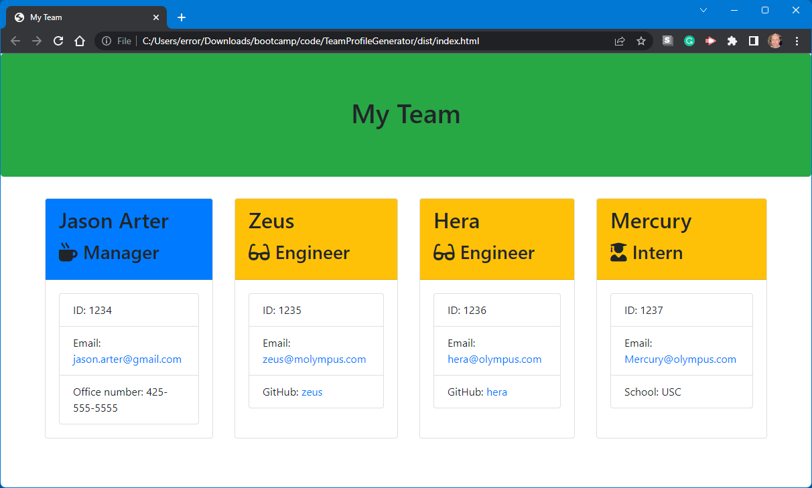

# TeamProfileGenerator

## Description

This project uses Node.js, the Node Package Manager (npm), Javascript classes, the Jest testing suite, the built-in 'fs' pacakage, and the Inquirer package to create a team webpage based on the user's input.

## Table of Contents (Optional)

- [Installation](#installation)
- [Usage](#usage)
- [Credits](#credits)
- [License](#license)

## Installation

At the command prompt, type the following:   
```
git clone git@github.com:error201/TeamProfileGenerator.git
```
Navigate into the new directory, and type:

```
npm install
``` 
to install the necessary Node packages.

## Usage

to launch the program, at the command prompt, navigate into the project folder and type:
```
node index.js
```
Answer the on-screen questions about your team members. When finished, select `finish` from the menu. The generated `index.html` file can be found in the 'dist' folder.




## Credits

- [Jest](https://jestjs.io/)
- [Bootstrap](https://getbootstrap.com/) 
- [Node.js](https://nodejs.org/en/)
- [Inquirer](https://www.npmjs.com/package/inquirer)

## License

This project is covered by the MIT license. Please read [LICENSE](./LICENSE) for details..

---

## Badges


## How to Contribute

Please feel free to fork and/or clone this repo to contribute.

## Tests

To run the provided tests, at the command prompt, navigate into the project folder and type:
```
npm test
```
The results of the tests will be displayed.